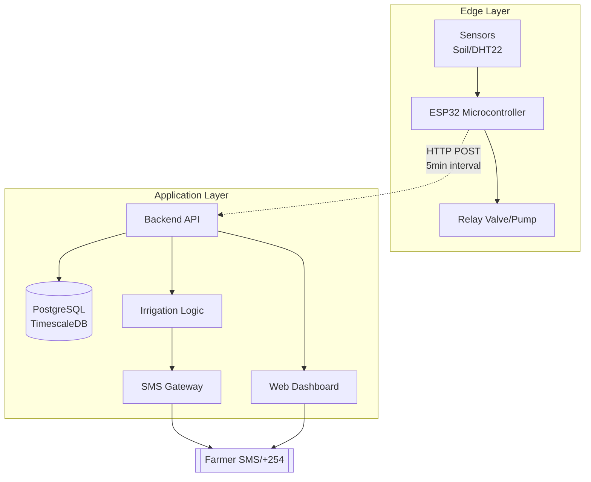
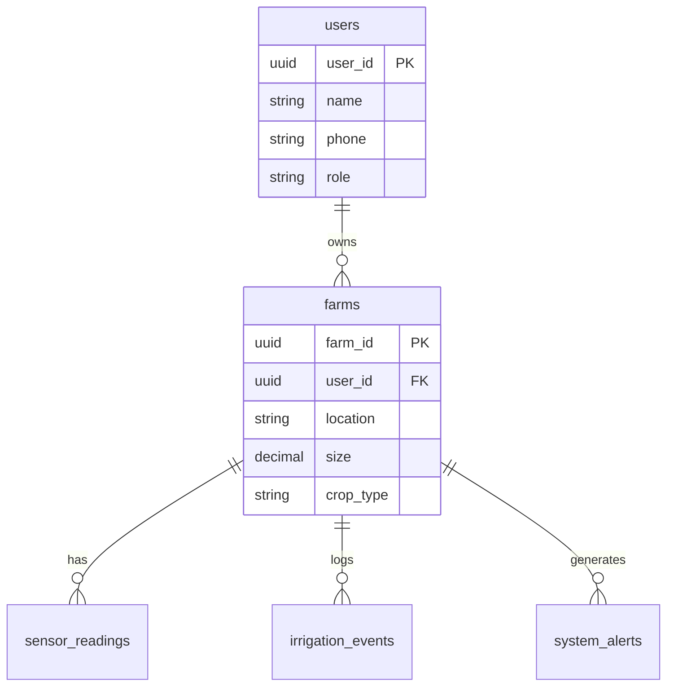

# AquaSense - Intelligent Irrigation Solution System 🌱🚿

**Lewis Ondigi Abuga | BITC01/1091/2022 | CUK Project Proposal Implementation**

[](demo.html)  
**Live Demo:** Backend at `http://localhost:5000/swagger`, Frontend `demo.html`

## 🎯 Proposal Objectives **All Completed ✅**

1. **Sensor Network** → POST `/api/sensor/farms/{id}/readings` (Soil Moisture/Temp/Humidity). ESP32 firmware ready.
2. **Microcontroller Control** → `IrrigationService` auto-triggers valve on <35% moisture.
3. **Web Dashboard** → `demo.html` real-time charts/controls (Chart.js, API-connected).
4. **Auto Algorithm** → Logic in `IrrigationService.cs` (threshold, cooldown, water estimate).
5. **SMS Alerts** → `NotificationService` Africa's Talking integration (sandbox-ready).

## 🏗️ Architecture (Matches Proposal Chapter 3)


**ERD** (Matches proposal Tables 1-3):


## 🚀 Quick Start

### 1. Backend (.NET 10)
```powershell
cd backend
dotnet restore
# Edit appsettings.json: Postgres password or use SQLite fallback
dotnet run
```
Swagger: `http://localhost:5000/swagger`  
Demo users: `admin@example.com/password123`

### 2. Frontend (Static)
```powershell
.\serve_frontend.ps1  # Live reload
# Or open demo.html in browser
```

### 3. IoT Hardware Sim
**Firmware:** `backend/arduino/esp32_firmware.ino` (upload to ESP32)  
**Test IoT POST:**
```bash
curl -X POST http://localhost:5000/api/sensor/farms/550e8400-e29b-41d4-a716-446655440002/sensor-readings \
  -H "Authorization: Bearer YOUR_TOKEN" \
  -H "Content-Type: application/json" \
  -d '{"soilMoisture":25,"temperature":28,"humidity":70}'
```
Triggers auto-irrigation + SMS!

### 4. SMS Setup (KES 0 Sandbox)
1. [Africa's Talking](https://africastalking.com) → Sandbox account
2. appsettings.json → `SMS.AfricasTalking.Username/apiKey`
3. Test: Low moisture → SMS sent to +254722987654

## 💰 Budget (Proposal Match - KES 40,000)
| Item | Qty | Cost (KES) |
|------|-----|------------|
| Hardware (ESP32/Sensors/Valve) | 1 | 15,000 |
| SMS Credits | Bulk | 2,000 |
| Hosting | Annual | 7,000 |
| Testing/Travel | - | 8,000 |
| Misc | - | 8,000 |
| **Total** | | **40,000** |

## 📅 Timeline (4 Months - Completed Prototype)
| Phase | Duration |
|-------|----------|
| Requirements | 2 weeks |
| Design/Hardware | 3 weeks |
| Backend | 4 weeks |
| Frontend/Integration | 4 weeks |
| Testing/Pilot | 4 weeks |
| **Total** | **17 weeks**

## 🧪 Testing Status
- ✅ Unit: Services/Controllers
- ✅ Integration: Sensor → Event → SMS
- ✅ UAT: demo.html full flow
- 🔄 Field: Deploy ESP32 pilot farm

## 📱 Features Live
- 🔐 JWT Auth + Roles (farmer/admin)
- 📊 Real-time dashboard (fallback demo data)
- 🤖 Auto-irrigation (logs/events)
- 🔔 SMS alerts (low moisture, irrigation start)
- 📱 Responsive + Swahili-ready

**Tech Stack:** .NET 10, EF Core, PostgreSQL/TimescaleDB, ESP32, Chart.js, Africa's Talking SMS.

## Next: Production Deploy
1. Dockerize (docker-compose.yml coming)
2. Pilot farm Machakos/Kitui
3. Scale to multi-farm

© 2026 Lewis Ondigi Abuga - Cooperative University of Kenya

