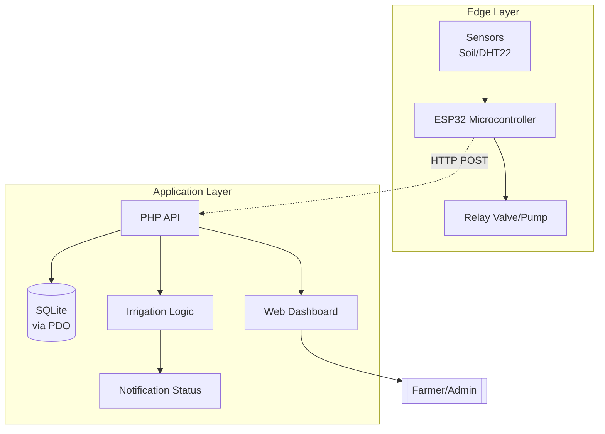

# AquaSense - PHP-Only Intelligent Irrigation Solution

**PHP Backend + SQLite | Full Migration Complete**

**Lewis Ondigi Abuga | BITC01/1091/2022 | CUK Project Proposal Implementation**

[](demo.html)  
**Live Demo:** PHP API at `http://127.0.0.1:8000/api`, Frontend `demo.html`

## Overview

AquaSense monitors soil conditions, logs irrigation activity, raises alerts, and drives a farmer dashboard.  
This version uses a PHP backend with SQLite instead of a standalone SQL schema file.

## Architecture



## Quick Start

### 1. Backend (PHP + SQLite)

Install PHP 8+ and make sure `php` is on your `PATH`, then run:

```powershell
.\serve_php_backend.ps1
```

That script:
- initializes the SQLite database
- seeds demo users, farms, readings, events, and alerts
- serves the API at `http://127.0.0.1:8000/api`

Demo users:
- `admin@example.com / password123`
- `farmer@kenya.com / irrigate2024`

### 2. Frontend

```powershell
.\serve_frontend.ps1
```

Then open the static site in your browser. The frontend now points to the PHP API by default.

### 3. Mock Data Simulation

Single-farm simulation:

```powershell
.\simulate_sensor_data.ps1
.\simulate_sensor_data.ps1 -LowMoisture
.\simulate_sensor_data.ps1 -Count 20 -IntervalSeconds 2
```

Multi-farm admin simulation:

```powershell
.\simulate_multifarm_data.ps1
.\simulate_multifarm_data.ps1 -DrySpell -Cycles 25 -IntervalSeconds 3
```

## PHP Database Replacement

The old standalone `schema.sql` file has been removed and replaced with PHP equivalents:

- `php/init_db.php`
  Creates all tables and seeds demo data.
- `php/bootstrap.php`
  Shared PDO connection, auth/token helpers, app state helpers, and JSON responses.
- `php/api/index.php`
  Main API router for auth, farms, sensors, irrigation, alerts, and notifications.
- `php/router.php`
  Router for the built-in PHP development server.
- `serve_php_backend.ps1`
  Starts the local PHP API after initializing the database.

## API Surface Used by the Frontend

- `POST /api/auth/login`
- `POST /api/auth/register`
- `GET /api/data/farms`
- `GET /api/data/farms/{farmId}/sensors`
- `GET /api/data/farms/{farmId}/events`
- `GET /api/data/farms/{farmId}/alerts`
- `GET /api/data/alerts`
- `POST /api/data/alerts/{alertId}/resolve`
- `POST /api/sensor/hardware/{farmId}/reading`
- `POST /api/sensor/farms/{farmId}/sensor-readings`
- `POST /api/irrigation/farms/{farmId}/irrigate`
- `GET /api/irrigation/farms/{farmId}/auto-mode`
- `PUT /api/irrigation/farms/{farmId}/auto-mode`
- `GET /api/notifications/status`

## Notes

- PHP is not installed in the current workspace environment, so the PHP server could not be executed here.
- The frontend and simulator defaults have already been switched to `http://127.0.0.1:8000`.
- The old .NET backend files are still present in the repo, but the active path is now the PHP backend and seeded SQLite database.

## Tech Stack

PHP 8+, SQLite, PDO, PowerShell helpers, ESP32, Chart.js.
